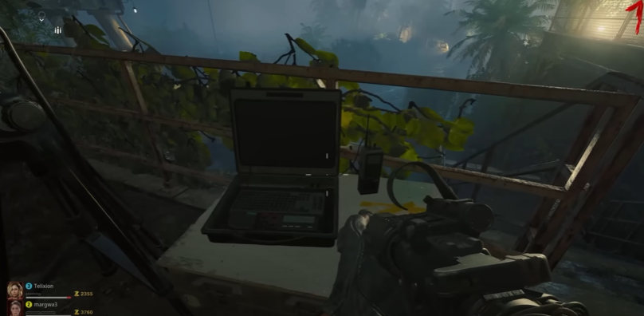
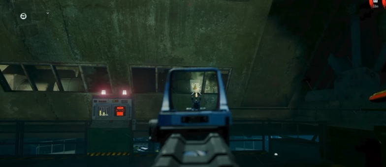

# Free Beamsmasher Guide

## Steps

### Step 1:
Activate three laptops around the map.

#### Laptop locations:
Outside in the storage area by Quick Revive.\
\
\
Outside in communications by Stamin-up.\
\
\
At the top of the stairs to the dock.\

### Step 2:
Apply Dead Wire on a gun. Activate the pack-a-punch lift and turn towards where pach-a-punch is facing. Shoot this electric box:\
\
\
\
This will create a stream of electricity that can simply be followed to another electric box, shoot that box to create another stream that leads to another box. Keep shooting a following until it opens the research office. Kill the zombie in that room and pick up the EMF FOB.

### Step 3:
Go to the sea tower and open a breifcase with a severed hand on a desk. Pick up the item and bring it into the research office and interact with the computer. Solve the math problem. The computer will have three sticky notes each labeled x, y, and z. Those notes will have symbols on the white board to match up.\
\
\
\
Depending on the symbol, the variable associated with that symbol will equal the number lined up on the y-axis and then the number lined up on the x-axis to create some two digit number. Note the value for each variable. Plug the numbers into the questions on the other whiteboard.\
\
\
\
The solution to each question, from top to bottom, will be the number to input into the computer, from left to right.

### Step 4:
On the next round the computer in the research lab will target a location on the map, head to that location. Interact with the colored orb and kill a glowing zombie, it will drop a small colored orb. Pick it up and bring it to the bigger orb. Repeat this until the colored orb goes away. Pick up the item dropped and then drive to the island with a next colored orb on it. Do this same process again. There will be a third island with a third colored orb. Make sure to pick up the item each time.

### Step 5:
Craft the Beamsmasher on the workbench in the research lab.

