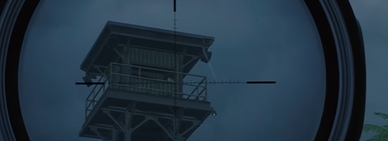
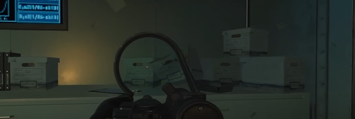
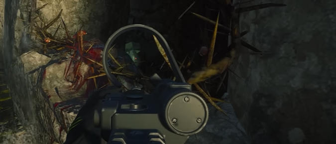
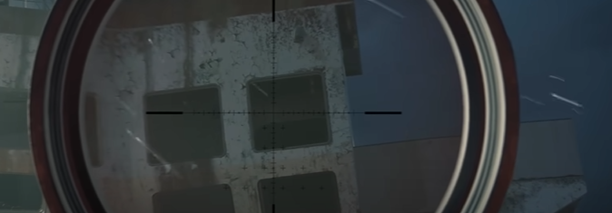
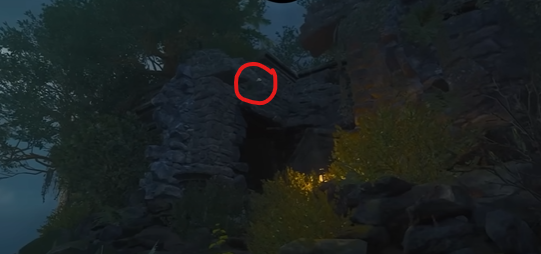
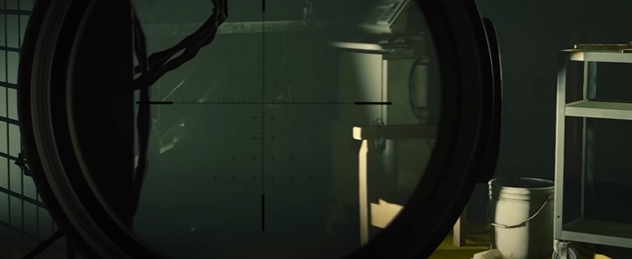
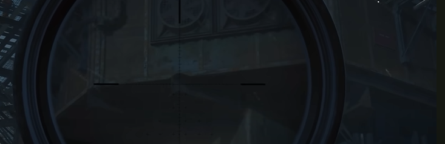

# Terminus Free Power-up Guide

## Max Ammo
Throw a grenade or explosive into this watchtower:\
\
\
\
You can also shoot the power-up from here:\
\

## Double Points
Shoot the boxes on the filing cabinet in the biolab.\
\
\
\
Shoot the power-up in those boxes.

## Nuke
Shoot the power-up in this window on Crab Island:\
\

## Bonus Points
Shoot the power-up in this window on the shipwreck:\
\

## Instakill
Shoot the power-up here on Temple Island:\
\

## Max Armour
Shoot this spot in the interrogation room:\
\

## Full Power
Shoot this spot on the underside of the sea tower:\
\

