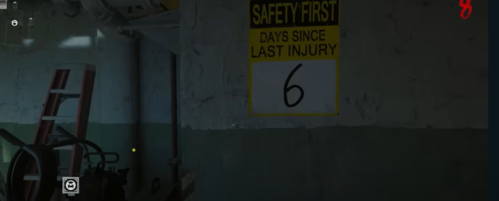

# Terminus Main Quest Guide

## Note:
* Need the Beamsmasher

## Steps

### Step 1:
Turn on power for the whole map.

### Step 2:
Activate pack-a-punch.

### Step 3:
Find a keycard located under one of the four tentacle traps. There are two in the biolab, one next to Juggernog,
and one in spawn by peck. Activate the trap and crouch under it and shoot the Beamsmasher back up into the trap.\
\
\
\
Pick up the harddrive. Give it to peck.

### Step 4:
In the biolab, interact with the tank in the center of the lab.\
\
\
\
Find three numbers to input into this machine, the numbers will be different every match. Have all members of the team interact with the valves on the tank. Doing so will begin a miniboss lockdown, kill the miniboss.

#### Number locations:
In the interogation rooms, the hour hand of this clock:\
\
\
The card on the corkboard in the mess hall.\
\
\
On the 'DAYS SINCE LAST INJURY' sign of the engineering room.\

### Step 5:
Jump into the water of the biolab and find a keycard resting at the bottom. Interact with this computer in the commmunications room:\
\
\
\
Keep interacting with it. Bring the whole team under the shipwreck, and climb up the ladder. Grab a couple of the pipes on the bench in that room. This will begin a lockdown. Once done check three locations to insert these pipes.

#### Pipe insertion locations:
On the south island, by the coast.\
\
\
In the Speed cola tunnel off on one of the sides.\
\
\
Under the sea tower.\

### Step 6:
Interact with peck until he gives you a hacking device. Pick it up and have a teammate drive the hacker around the water to three buoys. When close, hack the bouy (hacker can float in the water while hacking, driver can take the heat off of the hacker). When the first buoy is hacked, a timer will start. Once all buoys are hacked a new timer will start. Everyone needs to go into the biolab to find and disarm three bombs in the labs to end the timer.\
\
\
\
It takes about 15 seconds to disarm each bomb.

### Step 7:
Prepare for bossfight, get one weapon with some range to max rarity and max tier. It will take too many rounds to max out another gun. Try to bring in a chopper gunner as well. Make sure you got most perks.

### Step 8:
Enter the bossfight by initiating a vote on an ajar door in the biolab. The boss takes most of its damage while hitting its glowing weakpoints. The glowing spots will change frequently. It has a main slam attack in front of it that will kill without armor. The boss relocates based on where players are. The last phase, the weakpoints will be the eyes. Te sides of the arena are closed off and it will no longer move around The boss now employs a tounge attack in front of it that will kill you if you touch it. The boss will start to use a wipe attack when it conjures a electric ball above its head. Get out of line of sight when that happens. Use the chopper gunner during the last phase because he does not relocate during it.

### Step 9:
gg bye bye
